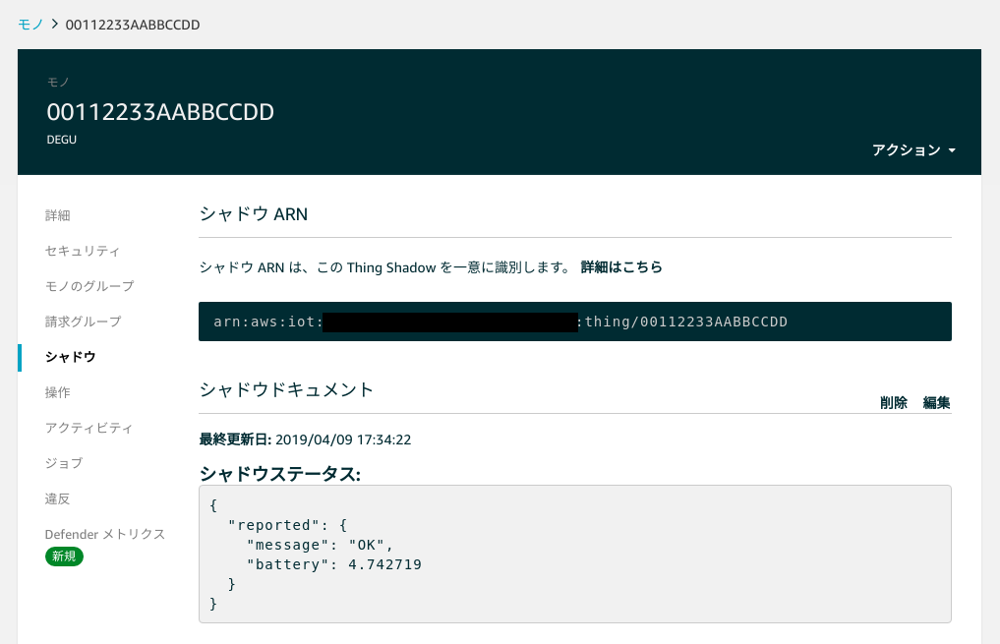

## MicroPythonコードの変更

DeguをMicroUSBケーブルでPCに接続すると、PC上では32KBのUSBマスストレージとして認識されます。

このマスストレージの先頭から16KB分はFAT12形式でフォーマットされており、デフォルトでは以下のファイルが格納されています。

* `main.py`
  * Degu起動後、自動実行されるMicroPythonコード

* `CONFIG`
  * Deguが使用する設定ファイル(現在未定義)

Deguは起動後、自動的に`main.py`を実行します。`main.py`が存在しない場合は、ZephyrのShellを起動し、USBシリアルコンソールに表示します。
`main.py`の内容を任意のMicroPythonコードに書き換えると、電源再投入以降、Deguは変更されたmain.pyを実行します。

例として、1分毎にバッテリー電圧を送信するスクリプトに書き換える手順を示します。

1. [ここ](https://raw.githubusercontent.com/open-degu/degu-micropython-samples/master/basic/battery/main.py)から、main.pyをダウンロードしてください。

1. ダウンロードした`main.py`で、DeguのUSBマスストレージに格納されている`main.py`を上書きしてください。

1. 各OSの正しい手順でPCからDeguを切断してください。

1. Deguの電源を入れ直すと、AWS IoT Coreに登録されたDeguのシャドウに、電源電圧が追加されます。

    