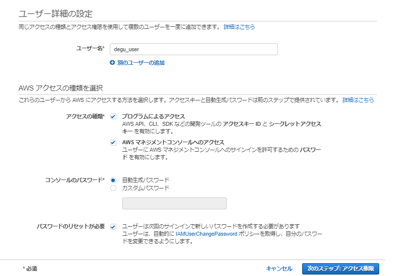
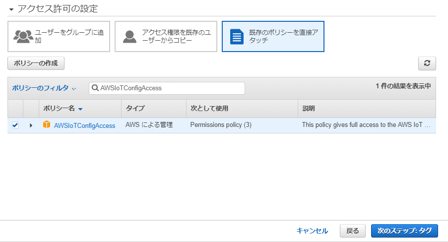
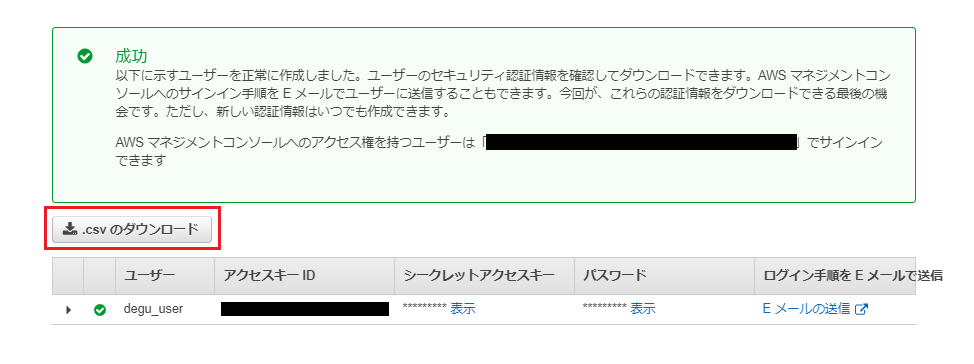

# Setup

本ページではDeguゲートウェイのセットアップ方法について記載しています。

* IAMユーザー作成
* Armadilloの設定
* DeguをAWSに登録

## 注意事項

既に **AWSのアカウントを作成し、AWSマネジメントコンソールにログインできていること** を前提としています。AWSアカウントの作成方法については、 https://aws.amazon.com/jp/register-flow/ を参照してください。

## IAMユーザー作成

AWSマネジメントコンソールへログインし、サービス一覧から**IAM**を選択してください。その後、ユーザータブを開き、「ユーザーを追加」をクリックします。

### ユーザーを追加
下記の通り入力、選択し「次のステップ: アクセス権限」に進みます  

* ユーザー名
* AWSアクセスの種類を**両方**選択
* コンソールのパスワードは**自動生成パスワード**を選択
* 「パスワードのリセットが必要」に**チェック**を入れる



### アクセス許可の設定
下記の手順でポリシーをアタッチし、「次のステップ: アクセス権限」に進みます  

* 「既存のポリシーを直接アタッチ」を選択
* ポリシーのフィルタに**AWSIoTConfigAccess**と入力
* 表示された**AWSIoTConfigAccess**にチェック



### タグの追加(オプション)
今回は設定不要です。「次のステップ: 確認」に進みます  


### 確認画面
確認画面が表示されます。設定した通りの内容になっていることを確認し、「ユーザーの作成」をクリックしてください。  


### IAMユーザー作成完了
成功すると下記のような画面が表示されます。  
後ほどArmadilloの設定で使用するため、ここでは必ず**csvのダウンロード**を忘れずに行ってください。  
行わなかった場合、再度IAMユーザーを作成する必要があります。  


## Armadilloの設定
Armadillo上では、下記の2点の設定ファイルを編集します。
* アクセスポイント設定ファイル
* AWS情報設定ファイル

Armadilloとの接続方法や設定ファイルの編集方法等の詳細については各製品のマニュアルを参照してください。

### rootのパスワードを変更

Armadilloでの下記の操作についてはrootユーザーで実行します。  
初期パスワードのままだとセキュリティリスクが高まるため、必ず初期パスワードを変更してください。

```
[armadillo ~]# passwd
Enter new UNIX password: # 新しいパスワードを入力
Retype new UNIX password: # 再入力
```

### アクセスポイント情報を変更する
各DeguをAWSに登録するには、Armadilloのアクセスポイントに接続する必要があります。  
初期設定では下記のSSIDとパスフレーズが設定されています。  

  | SSID | パスフレーズ |
  |:-----------|:------------|
  | MyAccessPoint | 12345678 |

この設定のままではパスフレーズを把握している誰もがアクセスすることができてしまうため、アクセスポイント情報の変更を行います。

### アクセスポイント設定ファイルの編集
1. 下記のコマンドで設定ファイル create_ap.conf を開きます。  
`root@armadillo:~#vi /etc/create_ap.conf`
2. create_ap.confを編集します。
#### create_ap.conf <初期設定>
```
CHANNEL=default
GATEWAY=10.0.0.1
WPA_VERSION=2
ETC_HOSTS=0
DHCP_DNS=gateway
NO_DNS=0
NO_DNSMASQ=0
HIDDEN=0
MAC_FILTER=0
MAC_FILTER_ACCEPT=/etc/hostapd/hostapd.accept
ISOLATE_CLIENTS=0
SHARE_METHOD=nat
IEEE80211N=0
IEEE80211AC=0
HT_CAPAB=[HT40+]
VHT_CAPAB=
DRIVER=nl80211
NO_VIRT=0
COUNTRY=
FREQ_BAND=2.4
NEW_MACADDR=
DAEMONIZE=0
NO_HAVEGED=0
WIFI_IFACE=wlan0
INTERNET_IFACE=eth0
SSID=MyAccessPoint
PASSPHRASE=12345678
USE_PSK=0
```
2点の項目を編集します。
* SSID
* PASSPHRASE

下記のSSIDとパスフレーズに設定する場合、

  | SSID | パスフレーズ |
  |:-----------|:------------|
  | DeguGW | degu-pass |

該当箇所を下記の通り編集します。
```
SSID=DeguGW
PASSPHRASE=degu-pass
```

#### create_ap.conf <編集後>
```
CHANNEL=default
GATEWAY=10.0.0.1
WPA_VERSION=2
ETC_HOSTS=0
DHCP_DNS=gateway
NO_DNS=0
NO_DNSMASQ=0
HIDDEN=0
MAC_FILTER=0
MAC_FILTER_ACCEPT=/etc/hostapd/hostapd.accept
ISOLATE_CLIENTS=0
SHARE_METHOD=nat
IEEE80211N=0
IEEE80211AC=0
HT_CAPAB=[HT40+]
VHT_CAPAB=
DRIVER=nl80211
NO_VIRT=0
COUNTRY=
FREQ_BAND=2.4
NEW_MACADDR=
DAEMONIZE=0
NO_HAVEGED=0
WIFI_IFACE=wlan0
INTERNET_IFACE=eth0
SSID=DeguGW
PASSPHRASE=degu-pass
USE_PSK=0
```

3. create_ap.confの編集後、Armadilloを再起動してください。  
`root@armadillo:~#reboot`
4. 再起動後、スマートフォン等からアクセスポイントに接続できることを確認します。

### DeguをAWS IoTに登録
1. アクセスポイントに接続後 `http://10.0.0.1/degu/` にアクセスすると下記の画面が表示されます。  
アクセスできない場合は下記を確認してください。
  * アクセスポイントが正しく設定されているか
  * 異なるアクセスポイントに接続していないか


2. DeguのMACアドレスを登録します。
MACアドレスの入力方法は下記の2パターンがあります。
* QRコードを読み取る
* MACアドレスを直接入力する

#### QRコードを読み取る
* `QRコードを読み取る` をタップすると、カメラが起動します。もし、カメラへのアクセスが許可されていない場合はアクセス許可の設定を行ってください。
PCで接続した場合は、ファイル選択画面が表示されます。このときは、QRコードを撮影した画像をアップロードしてください。

* Deguケース裏面のQRコードをカメラで撮影します。このとき、QRコードが小さいと読み込みを行うことができないため、拡大して撮影してください。
読み取れない場合は下記のエラーが表示されます。


* 正しく読み込めた場合、`読み取ったQRコード`にMACアドレスが表示されます。表示されている内容がQRコードの左側に記載されている12桁の英数字と一致しているか確認し、`登録`をタップしてください。なお、QRコードの読み込みが失敗した状態(`読み取ったQRコード`が空欄)で`登録`をタップすると、`No mac address`と表示されます。このときは、再度QRコードの読み込みを行ってください。


#### MACアドレスを直接入力する
* `読み取ったQRコード`の欄に下記の画像の場所に記載されているMACアドレスを入力します。この時、アルファベットについては**大文字**で入力してください。なお、空欄の状態で`登録`をタップすると`No mac address`と表示されます。このときは、再度入力を行ってください。なお、入力したMACアドレスの正当性確認は行っておりません。誤った内容で`登録`をタップすると入力した内容のままAWS IoTに登録されてしまい、AWS IoT上での削除操作等が必要になるためご注意ください。

3. `登録`をタップ後、`読み取ったQRコード`の欄が空欄になったら登録完了です。IoT Coreの「モノ」に現在登録したMACアドレスが名前のデバイスが登録されていることを確認してください。**現状、AWS IoT上のデバイス名はMACアドレスを用いています。**
下記の場合は、AWS IoTに登録されたデバイスを削除し、再度デバイスの登録作業を行ってください。
* アルファベットの大文字・小文字両方のデバイス名が登録されている
* MACアドレスと異なる名前で登録されている

#### 削除方法
「モノ」の一覧画面において、削除対象の下記の場所をクリックし、削除を選択してください。


## 注意事項
* 起動してから接続されるまで10sくらいかかる

### AWS情報設定ファイルの編集
1. ArmadilloとPCをUSBシリアル変換アダプタで接続します。  
このとき、USBシリアル変換アダプタのスライドスイッチは内側にしてください。
2. シリアル通信ソフトウェアを起動し、Armadilloの電源を投入します。
3. 起動後、rootユーザーでログインします。
```
Debian GNU/Linux 9 armadillo ttymxc4

armadillo login: root
Password:
root@armadillo:~#
```

4. 下記のコマンドで設定ファイル mqttinfo.json を開きます。  
`root@armadillo:~#vi /etc/mqttinfo.json`

5. mqttinfo.jsonを編集します。 
#### mqttinfo.json <編集前>

```
{
  "key" : "/etc/coap-mqtt/private.pem.key",
  "cert" : "/etc/coap-mqtt/certificate.pem.crt",
  "cafile" : "/etc/coap-mqtt/RootCA.crt",
  "aws_endpoint" : "",
  "secretaccesskey" : "",
  "accesskeyid" : "",
  "region" : ""
}
```

4点の項目を編集します。
* aws_endpoint
* secretaccesskey
* accesskeyid
* region

#### aws_endpoint
IoT Coreのエンドポイントを指定します。  
AWSマネジメントコンソールへログインし、サービス一覧から**IoT Core**を選択してください。  
「設定」タブを開き、カスタムエンドポイントに表示されているエンドポイントをコピー、下記の通り修正します。

* エンドポイントが `xxxxx.iot.ap-northeast-1.amazonaws.com` の場合
```
  "aws_endpoint" : "xxxxx.iot.ap-northeast-1.amazonaws.com",
```

#### secretaccesskey
シークレットアクセスキーを指定します。  
IAMユーザー作成時にダウンロードしたcsvファイルに記載されています。

* Secret access keyが `asdfghjkl` の場合
```
  "secretaccesskey" : "asdfghjkl",
```

#### accesskeyid
アクセスキーIDを指定します。  
IAMユーザー作成時にダウンロードしたcsvファイルに記載されています。

*   Access key IDが AWS123 の場合
```
  "accesskeyid" : "AWS123",
```

#### region
リージョンを指定します。  
エンドポイントから取得できます。

* エンドポイントが xxxxx.iot.ap-northeast-1.amazonaws.com の場合
```
  "region" : "ap-northeast-1"
```

#### mqttinfo.json <編集後>

```
{
  "key" : "/etc/coap-mqtt/private.pem.key",
  "cert" : "/etc/coap-mqtt/certificate.pem.crt",
  "cafile" : "/etc/coap-mqtt/RootCA.crt",
  "aws_endpoint" : "xxxxx.xxxx.amazonaws.com",
  "secretaccesskey" : "asdfghjkl",
  "accesskeyid" : "AWS123",
  "region" : "ap-northeast-1"
}
```

6. mqttinfo.jsonの編集後、Armadilloを再起動してください。  
`root@armadillo:~#reboot`
