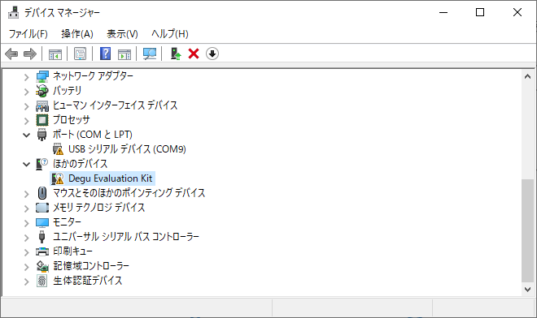
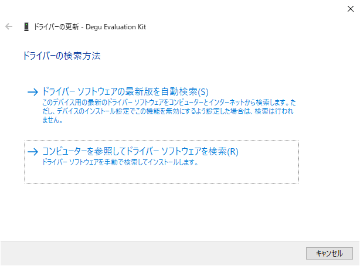
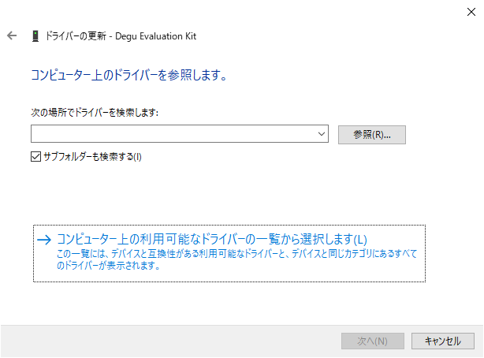
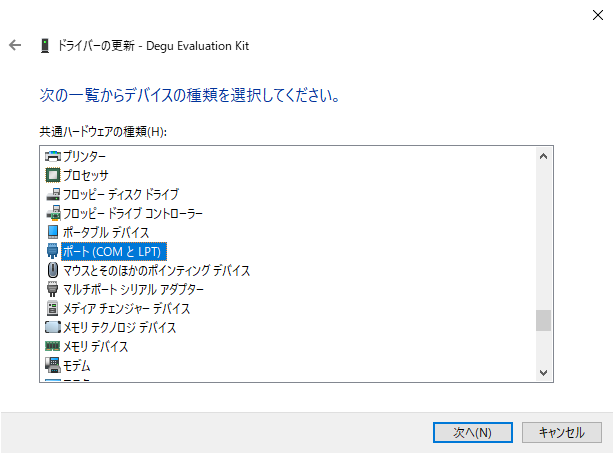
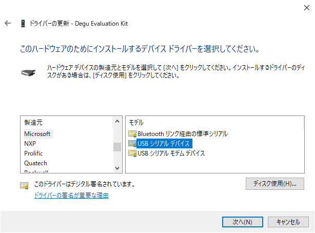

## シリアルコンソール

DeguをMicroUSBケーブルでPCに接続すると、PC上ではCDC ACM Classとして動作します。
これは、シリアルコンソールとして利用することができ、MicroPythonの標準出力、またはシェルとして動作します。

### Windowsでシリアルコンソールを利用する

WindowsでDeguのシリアルコンソールに接続するには、デフォルトでアタッチされるデバイスドライバーを変更する必要があります。

1. スタートボタンを右クリックし、デバイスマネージャーを起動してください。
1. "ほかのデバイス" -> "Degu Evaluation Kit" を右クリックし、"ドライバーの更新" をクリックしてください。

    


1. "コンピューターを参照してドライバーソフトウェアを検索(R)" をクリックしてください。

    

1. "コンピューター上の利用可能なドライバの一覧から選択します(L)" をクリックしてください。

    

1. "ポート(COMとLPT)" をクリックしてください。

    

1. 製造元を"Microsoft"、モデルを"USBシリアルデバイス"を選択し、"次へ(N)"をクリックしてください。

    

1. 警告が表示されますが、無視してください。

これで、WindowsでDeguのシリアルコンソールに接続する準備が完了しました。


### シリアル接続用のアプリケーション

Deguのシリアルコンソールを使用するには、以下のようなアプリケーションを利用してください。

* Minicom
* Tera Term

#### Minicom

Linuxの場合、代表的なアプリケーションとしてMinicomを利用することができます。

##### Minicomのインストール

* Debian GNU/Linux, Ubuntuの場合

```
$ sudo apt install minicom
```

##### Minicomでの接続

```
$ sudo minicom -D /dev/ttyACM0 -b 115200 -c on
```

#### Tera Term

Windowsの場合、代表的なアプリケーションとして[TeraTerm](https://ja.osdn.net/projects/ttssh2/)を利用することができます。

##### Tera Termのインストール

[Tera Termのインストール方法](https://ja.osdn.net/projects/ttssh2/howto/install)を参照してください。

##### Tera Termでの接続

[Tera Termの使い方](https://ja.osdn.net/projects/ttssh2/howto/usage)を参照してください。
